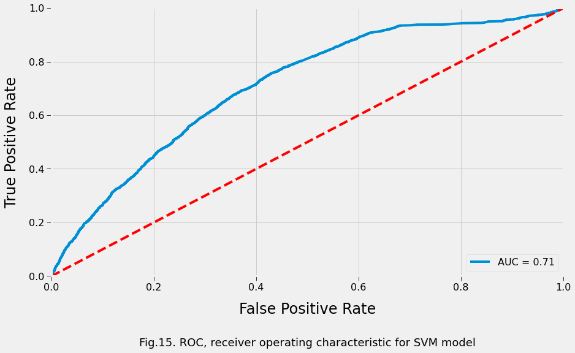

<br/><br/><br/><br/>

----------

# Patient Safety: Receive Quality Care or Your Autopsy Is Free  

**Code Caviar Story**: https://www.bingyune.com/blog/patient-safety-los

## Project Overview

Due to the growing number of hospitalized COVID-19 patients, predicting the average length of stay has become increasingly important for both resource planning and effective admission scheduling. Length of Stay (LOS) is defined in number of days from the initial admit date to the date that the patient is discharged from any given hospital facility. LOS estimates are useful for planning the available bed capacity, the number of specialists needed on call, and the potential discharge dates for patients to safely return home. Advanced LOS estimates at the time of admission can also greatly enhance the quality of care for patients. For instance, if hospitals prematurely discharged patients to reduce costs, lower than expected LOS numbers could be an indication of poor quality care at the facility. On the other hand, hospitals having longer than expected LOS numbers might also be extending LOS for patients because of poor quality care at the facility.

**The goal of this project is to create a model that predicts the length of stay for each patient at time of admission.** The project makes use of the [MIMIC](https://mimic.physionet.org/) database: "MIMIC is an openly available dataset developed by the MIT Lab for Computational Physiology, comprising deidentified health data associated with ~60,000 intensive care unit admissions. It includes demographics, vital signs, laboratory tests, medications, and more."

## Summary of Results

Rather than predicting the exact LOS for hospitalized patients, the project aimed to predict short-term vs. long-term LOS for each patient, where a LOS less than or equal to 5 days was considered to be short-term. The threshold of less than or equal to 5 days was chosen because 5 was close to the mean, median, and mode for the distribution of LOS, especially when we removed outliers of more than 20 days.

The project implemented, compared, and assessed five supervised learning algorithms: Random Forests, Logistic Regression, K-Nearest Neighbor, Linear Discriminant Analysis, and Support Vector Machine (SVM). The models were chosen due to their popularity and suitability for the problem under consideration. The SupportVectorClassifier for SVM performed the best with an accuracy of approximately 67% and an AUC-ROC score of approximately 71%.


The ROC curve shows the false positive rate (FPR) against the True Positive rate (TPR). The ideal ROC curve would be at the top left-hand corner of the image at a TPR of 1.0 and FPR of 0.0, our model is slightly above average as it's above the basic threshold which is the red line at 50%. We have an AUC ROC score of 71% with the implemented SVM model - a 4.4% improvement from the default SVM model.



## Getting Started

Cloning the git repository and installing the provided packages will help you get a copy of the project up and running on your local machine. The analysis for this project was performed using Jupyter Notebook (.ipynb) and the packages were managed using the Anaconda platform.

```
git clone https://github.com/codecaviar/patient_safety_los.git
conda env create -f environment.yml
```

File Description:
* environment.yml - packages used to perform this analysis   
* notebook_patient_safety.ipynb - Jupyter Notebook for this project including data exploration, feature engineering, and prediction modeling

**NOTE:** The MIMIC database has special access requirements, so this repository only provides the filenames used in this project at the time of print:
* ADMISSIONS.csv.gz - Admissions information including admission time, discharge time,  ethnicity, religion, insurance, and admission type
* PATIENTS.csv.gz - Patient specific info such as gender and de-identified date of birth
* DIAGNOSES_ICD.csv.gz - ICD-9 diagnosis for each admission to hospital
* ICUSTAYS.csv.gz - Intensive Care Unit (ICU) ward information for each admission to hospital

## Authors

- **BingYune Chen** - [LinkedIn](https://www.linkedin.com/in/bingyune-chen/)
- **BingYune & Co** - [GitHub](https://github.com/codecaviar)

## License

This project is licensed under the MIT License - see the [LICENSE](LICENSE) file for details

## Acknowledgments

MIMIC-III, a freely accessible critical care database. Johnson AEW, Pollard TJ, Shen L, Lehman L, Feng M, Ghassemi M, Moody B, Szolovits P, Celi LA, and Mark RG. Scientific Data (2016). DOI: 10.1038/sdata.2016.35. Available from: http://www.nature.com/articles/sdata201635

The project referenced the following:
* https://microsoft.github.io/r-server-hospital-length-of-stay/
* https://www.ncbi.nlm.nih.gov/pmc/articles/PMC5898738/
* https://medium.com/@daniel.j.cummings/predicting-hospital-length-of-stay-at-time-of-admission-55dfdfe69598
* https://cmmid.github.io/topics/covid19/los-systematic-review.html
* http://www.tmrfindia.org/ijcsa/v11i33.pdf
* https://www.iit.demokritos.gr/sites/default/files/paper_6.pdf

----------
The Code Caviar is a digital magazine about data science and analytics that dives deep into key topics, so you can experience the thrill of solving at scale.
